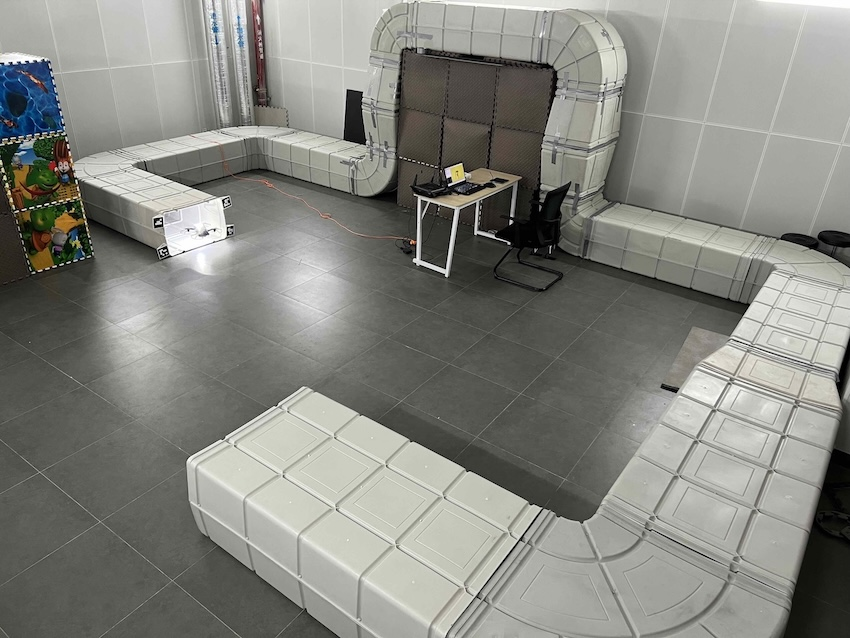
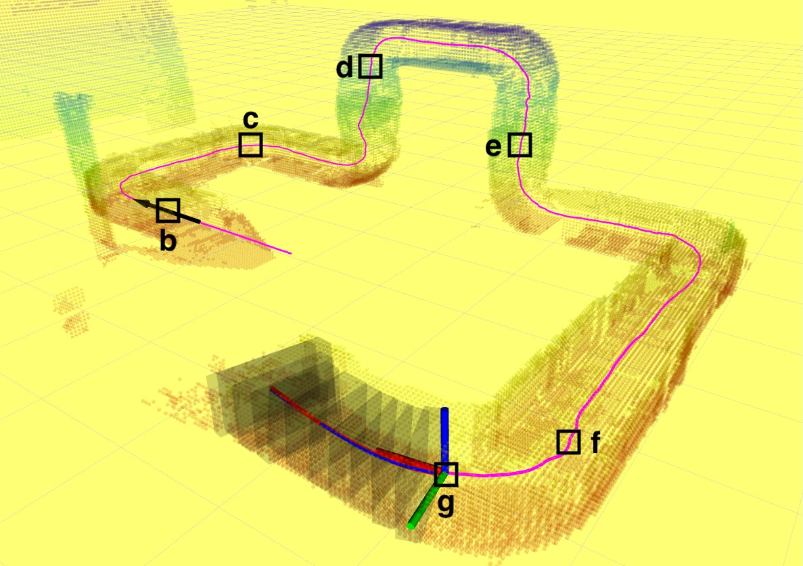
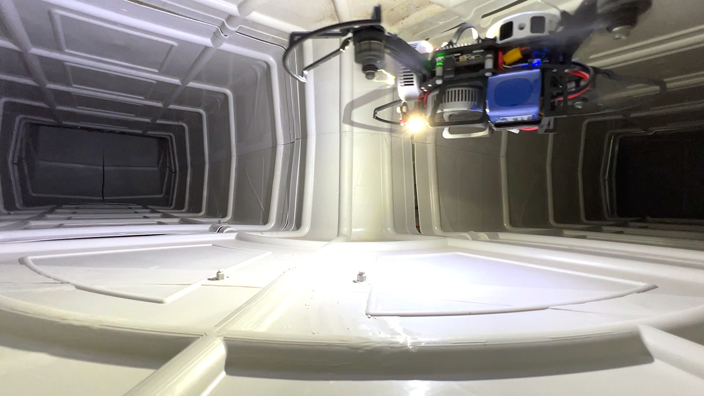
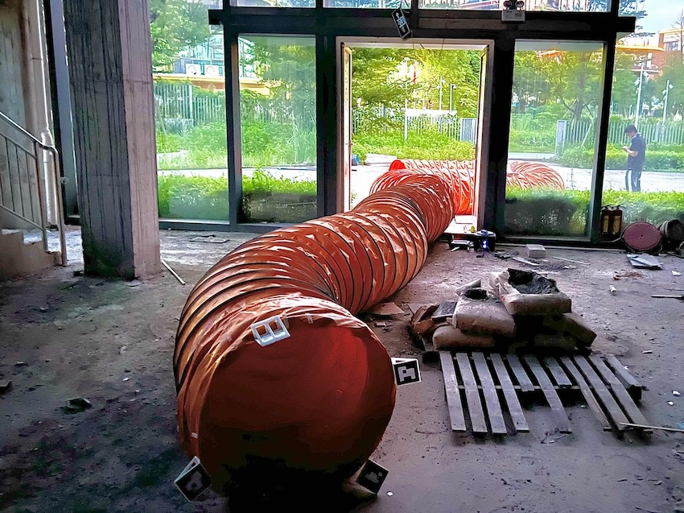
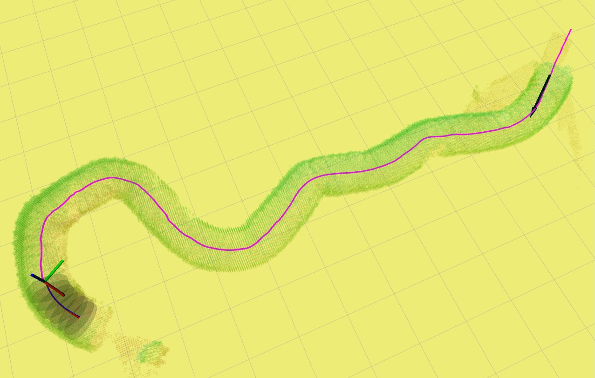
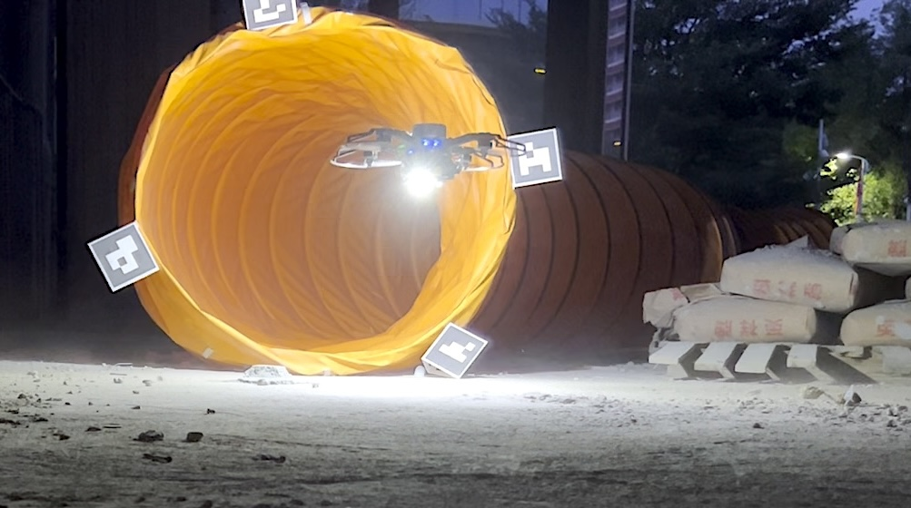
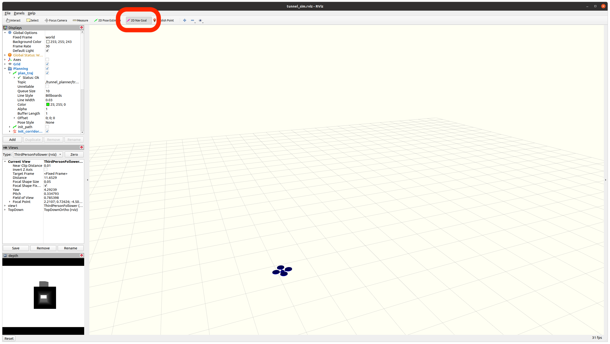
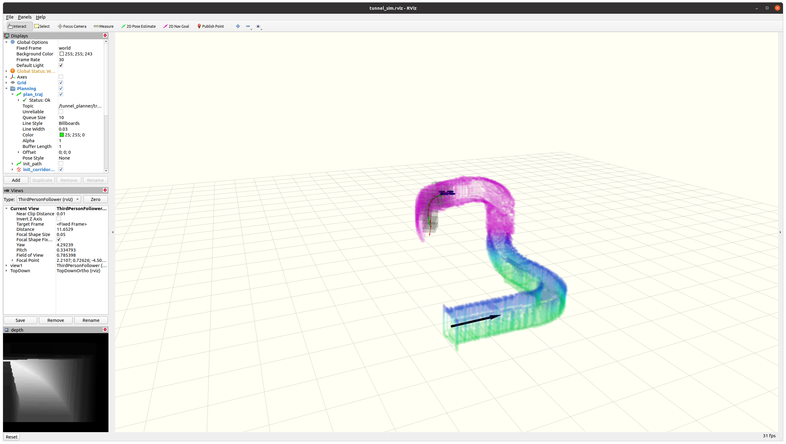

# FINT

<div align="center">
<a href="https://arxiv.org/abs/2505.19657">

</a>
<a href="https://www.youtube.com/watch?v=S20QSIypYgY">

</a>
</div>

This is the code repository for the paper contributed to IEEE T-RO: 

**[Autonomous Flights Inside Narrow Tunnels](https://ieeexplore.ieee.org/document/10916509)**

**Authors**: Luqi Wang, Yan Ning, Hongming Chen, Peize Liu, Yang Xu, Hao Xu, Ximin Lyu, and [Shaojie Shen](https://uav.hkust.edu.hk/group/).

This paper introduces an autonomous aerial system designed for narrow tunnel flights. This is the first known autonomous quadrotot system capable of flying through real tunnels in arbitrary diections and as narrow as 0.5 m in cross-section diameter.


<div align="center">



</div>

<div align="center">



</div>

Please cite our paper if you use this project in your research:

Wang, L., Ning, Y., Chen, H., Liu, P., Xu, Y., Xu, H., Lyu, X. & Shen, S. (2025). Autonomous Flights Inside Narrow Tunnels. IEEE Transactions on Robotics.
```
@ARTICLE{wang2025autonomous,
  author={Wang, Luqi and Ning, Yan and Chen, Hongming and Liu, Peize and Xu, Yang and Xu, Hao and Lyu, Ximin and Shen, Shaojie},
  journal={IEEE Transactions on Robotics}, 
  title={Autonomous Flights Inside Narrow Tunnels}, 
  year={2025},
  volume={41},
  pages={2230-2250},
  doi={10.1109/TRO.2025.3548525}}
```

Please kindly star :star: this project if it helps you. Thanks for your support! :sparkling_heart:

## Contents
- [FINT](#FINT)
  - [Modules](#Modules)
  - [Getting Started](#getting-started)
    - [Prerequisites](#prerequisites)
    - [Simulation](#simulation)
    - [Use VINS-Multi in Real-world UAV Deployment](#use-vins-multi-in-real-world-uav-deployment)
  - [Acknowledgements](#acknowledgements)

## Modules
This project includes the following modules:

* UAV Simulator
This module provides perception and motion simulation environment.

* Tunnel Planner
This module performs map fusion and perception-and-disturbance-aware tunnel planning.

* VINS-Multi
A robust optimization-based asynchronous multi-camera-IMU state estimator.

* Quadrotor Msgs
Supporting customized ROS messages. 


## Getting Started
The setup commands have been tested on Ubuntu 20.04 (ROS Noetic). If you are using a different Ubuntu distribution, please modify accordingly.

### Prerequisites

* Ubuntu and ROS
Ubuntu 64-bit 20.04.
ROS Noetic. [ROS Installation](http://wiki.ros.org/ROS/Installation)


* NLopt 2.7.1
Follow [NLopt Installation](https://nlopt.readthedocs.io/en/latest).


### Simulation

* Clone the repository

  For the simulation, the VINS-Multi submodule is not required, you do not need to pull the submodule 

  ```
    cd ${YOUR_WORKSPACE_PATH}/src
    git clone https://github.com/HKUST-Aerial-Robotics/FINT.git
    cd ..
    catkin_make
    source devel/setup.bash  
    # or
    source devel/setup.zsh  
  ```
* Run the simulation
  ```
    # open rviz
    roslaunch tunnel_planner tunnel_sim_rviz.launch
    # start the simulator and planner
    roslaunch tunnel_planner drone_small_sim.launch
  ```
  In the RViz window, click "2D Nav Goal" or press shortcut "G" and then click any point in RViz to start the flight.
<div align="center">


</div>

  Tunnels can be changed in [simulator.xml](tunnel_planner/launch/simulator.xml). The following tunnels are provided in this repository:
  * sharp_circle_3d
  * sharp_rect_3d
  * 3d_circle_tunnel
  * 3d_rect_tunnel

### Use VINS-Multi in Real-world UAV Deployment

* Pull the submodule

```
  cd ${YOUR_WORKSPACE_PATH}/src/FINT
  git pull --recurse-submodules
```

* Follow the installation steps in [VINS-Multi](https://github.com/HKUST-Aerial-Robotics/VINS-Multi) to get started. 


## Acknowledgements
* [NLOpt](https://nlopt.readthedocs.io/): An open-source library for nonlinear optimization
* [VINS-Fusion](https://www.open3d.org/): An open-source library that supports rapid development of software that deals with 3D data
